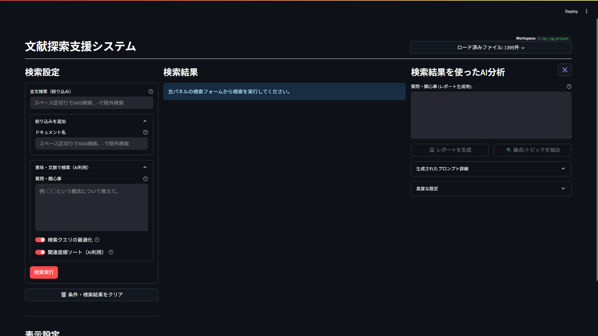

# Local-Japanese-RAG

**Japanese-First, High-Precision, Local RAG System.**
完全ローカル環境で動作する、日本語文書に特化した高精度な文献調査・分析システムです。



## 💡 コンセプト (Concept)

本プロジェクトは、単なる「質問に答えるチャットボット」ではなく、研究者や実務家が**「根拠を確認しながら深く分析できる調査ツール」**を目指して開発しました。

- **完全ローカル志向**: 機密性の高い文献を扱うため、外部APIへのデータ送信を行いません。Ollamaとローカルモデルのみで完結します。
- **ミドルレンジGPUへの最適化**: RTX 3060 (VRAM 12GB) 程度の一般的なゲーミングPC環境で、実用的な速度（検索～表示まで数秒）が出るように設計しています。
- **「守り」の検索ロジック**: 単純なベクトル検索だけでなく、キーワード検索やリランキング、そして取りこぼしを防ぐ独自のバックフィル処理を組み合わせ、情報の欠落を最小限に抑えます。

## ✨ 主な機能 (Key Features)

### 1. 🇯🇵 日本語への徹底的な最適化
英語圏のRAGツールでは対応しきれない、日本語特有の処理を実装しています。
- **和暦・西暦の正規化**: `date_standardizer.py`
  - 「明治20年」と入力しても「1887年」の情報も同時に検索。すべてのクエリに対して透過的に処理され、歴史的な文献の検索精度を向上させています。
- **表記揺れの吸収**: `kanji_converter.py`
  - LLMが生成しがちな簡体字・繁体字（「对」「岛」など）を、日本語の標準的な漢字（新字体）に強制変換するマッピング機能を搭載（※全てに対応できるわけではありません）。
- **高度な形態素解析**: `SudachiPy` を採用し、文脈を考慮したトークン化を行っています。

### 2. 🧠 AIによる検索クエリ最適化
ユーザーの曖昧な質問を、検索エンジンの特性に合わせてAIが3種類に書き換えます。
- **キーワード検索用**: 助詞を省き、重要な名詞・動詞を抽出（SudachiPyによる解析と併用）。
- **ベクトル検索用**: 「～について知りたい」などのノイズを除去し、トピックを表す名詞句へ要約。
- **リランキング用**: 文書の適合度判定に適した「明確な疑問文」へ変換。
  > ※UI上のトグルでOFFにすることも可能です（専門用語を厳密に検索したい場合など）。

### 3. 🛡️ 独自の「守りの検索」アーキテクチャ
「AIが選んだ上位数件」だけでは不安な調査業務のために、多層的な検索ロジックを実装しています。

1. **Hybrid Search (広範囲収集)**
   - **BM25**: キーワード完全一致重視。
   - **Vector (LanceDB)**: 意味・文脈重視。
2. **AI Reranking (精査)**
   - 収集した候補（最大100件以上）に対し、`Cross-Encoder` モデルを用いて「質問に対する回答としての適切さ」を判定し、並べ替えます。
3. **Defensive Backfill (穴埋め・救済)**
   - リランキングで漏れた文書についても、「BM25スコアが極端に高いもの」や「ベクトル距離が近く、かつキーワードが含まれるもの」を敗者復活させるロジックを搭載。AIの判定ミスによる情報の取りこぼしを防ぎます。

### 4. 🔍 調査特化型 3パネルUI
- **左 (Settings)**: 検索クエリの入力と、詳細なフィルタリング設定。
- **中 (Evidence)**: 検索ヒット箇所をハイライト表示。リランキング順に加え、AIが弾いた「その他の候補」も確認可能。
- **右 (Analysis)**: 検索結果に基づいたレポート生成。
  - **出典明記**: 回答の各文末に `[1]`, `[出典: ファイル名]` を厳密に付与。
  - **論点抽出**: 検索結果から「次に調べるべきトピック」をAIが提案する機能。

## 🛠️ 検証済みモデル・環境 (Validated Models & Specs)

本システムは、以下のモデル構成および環境で開発・動作検証を行っています。

| Category | Model Name (Tested) | Role |
| --- | --- | --- |
| **LLM** | `Qwen3-4B-Instruct-2507-IQ4_NL.gguf` | レポート生成、クエリ最適化 (Ollama上で動作) |
| **Embedding** | `Qwen3-Embedding-4B-f16.gguf` | 文書のベクトル化 (Ollama上で動作) |
| **Reranker** | `BAAI/bge-reranker-v2-m3` | 検索結果の再順位付け (Local) |
| **Similarity** | `pkshatech/simcse-ja-bert-base-clcmlp` | 文書の重複排除・Deduplication (Local) |

- **推奨ハードウェア**: NVIDIA GPU (VRAM 8GB〜12GB推奨)
  - ※開発環境: RTX 3060 (12GB) / System RAM 32GB
  - ※上記構成において、リランキング(Deep Mode)を含む検索処理を数秒〜10秒程度で完了可能です。

## ⚠️ 制限事項・免責 (Limitations)

- **対応フォーマット**: 実装上は `.txt`, `.md`, `.pdf`, `.csv` の読み込みに対応しています。
  - PDFについては `PyPDFLoader` を使用していますが、複雑なレイアウトや縦書き文書の解析精度はライブラリの性能に依存します。
  - 基本的にテキストベース（UTF-8/Shift-JIS自動判定）での利用を想定しています。
- **開発経緯**: 本プロジェクトは、AIコーディング支援を受けながら開発されており、コードベースにはAI由来のパターンが含まれています。

## 🚀 インストールと実行 (Installation)

本システムは、プロジェクト固有の仮想環境（`.venv`）で動作するように設計されています。また、起動用のバッチファイルを使用することで、HuggingFaceのモデルキャッシュ等をプロジェクトフォルダ内に隔離し、ポータブルな環境で実行できます。

### 前提条件 (Prerequisites)

1.  **Ollama のインストールと起動**:
    - [Ollama](https://ollama.com/) をインストールし、バックグラウンドで起動しておいてください。
    - 検証済みモデル（`Qwen3-4B-Instruct` 等）をロードできる状態にしておく必要があります。
      - ※`config.toml` で使用するモデル名を指定可能です。

### ステップ1：環境構築

PowerShell または コマンドプロンプトで以下の手順を実行します。

#### 1. プロジェクトフォルダへ移動
```powershell
git clone https://github.com/YourRepo/Local-Japanese-RAG.git
cd Local-Japanese-RAG
```

#### 2. 仮想環境の作成と有効化
**※重要**: 同梱の `run_app.bat` は、`.venv` という名前の仮想環境を使用します。必ず以下の名前で作成してください。
```powershell
python -m venv .venv
.venv\Scripts\activate
```

#### 3. GPU版 PyTorch の先行インストール
**最重要**: `requirements.txt` を実行する**前**に、明示的に GPU 対応版をインストールします（以下はCUDA 12.4対応版の例）。
```powershell
pip install torch==2.6.0 torchvision==0.21.0 torchaudio==2.6.0 --index-url https://download.pytorch.org/whl/cu124
```

#### 4. 依存ライブラリの一括インストール
```powershell
pip install -r requirements.txt
```

### ステップ2：アプリケーション起動

付属のバッチファイルを使用して起動することを推奨します。

#### 推奨: バッチファイルでの起動
`run_app.bat` をダブルクリックするか、コマンドラインから実行します。

```powershell
.\run_app.bat
```

> **💡 バッチファイルの利点**:
> - **環境の隔離**: モデルのキャッシュ（HuggingFace/SentenceTransformers）をプロジェクト内の `temp/` フォルダに保存します。Cドライブの容量を圧迫せず、フォルダごとの移動や削除が容易になります。
> - **自動設定**: 仮想環境の有効化や必要な環境変数の設定を自動で行います。

#### 手動での起動
開発などで手動実行する場合は、仮想環境を有効化した状態で以下を実行してください。

```powershell
# 仮想環境を有効化 (まだの場合)
.venv\Scripts\activate

# アプリ起動
streamlit run src/app.py --server.fileWatcherType none
```

---
*Built with Streamlit, Ollama, LanceDB, and SudachiPy.*